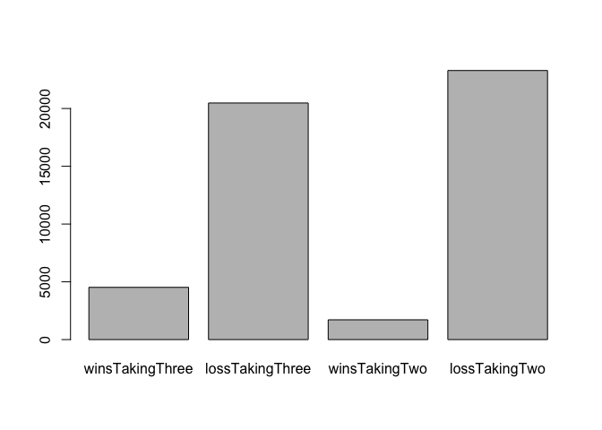

3 pointer or 2 points and foul
------------------------------

    trials <- 25000  ## Number of trials to run for simulation
    timeLeft <- 30
    pointsDown <- 3
    threePtPercent <- 35  # Your % chance of making 3-pt shot
    twoPtPercent <- 45  # Your % chance of making a 2-pt shot
    oppTwoPtPercent <- 40  # Opponent % chance making 2-pter
    oppFtPercent <- 80 # Opponent's FT %
    timeToShoot2 <- 5  # How many seconds elapse to shoot a 2
    timeToFoul <- 3  # How many seconds elapse to foul opponent
    offenseReboundPercent <- 25  # % of regular offense rebound
    ftReboundPercent <- 15  # % of offense rebound after missed FT
    overtimePercent <- 50  # % chance of winning in overtime
    i = 1 # initialize the simulation

Including Plots
---------------

You can also embed plots, for example:

    ## takeThree determines if we win in a given trial when we take a 3.  We first see if we make the 3.  Then we see if we can win in overtime
    takeThree <- function() {
      if (sample(0:100, 1) <= threePtPercent) {
        if (sample(0:100, 1) <= overtimePercent) {
          return (TRUE)  # We won!!
        }
      }
      return (FALSE)  # We either missed the 3 or lost in OT
    }

    takeTwo <- function() {
      havePossession <- TRUE
      while(timeLeft > 0) {
        ## What to do if we have possession
        if (havePossession) {
          # If we are down by 3 or more, we take the
          # 2 quickly.  If we are down by 2 or less
          # We run down the clock first
          if (pointsDown >= 3) {
            timeLeft = timeLeft - timeToShoot2
          } else {
            timeLeft = 0
          }
          ## Do we make the shot?
          if (sample(0:100, 1) <= twoPtPercent) {
            pointsDown = pointsDown - 2
            havePossession = FALSE
          } else {
            # Does the opponent team rebound?
            # If so, we lose possession.
            # This doesn't really matter when we run
            # the clock down
            if (sample(0:100, 1) >= offenseReboundPercent) {
            havePossession = FALSE
            }
          }
        } else { 
          # cases where we don't have possession
          if (pointsDown > 0) { 
            # foul to get back possession
            # takes time to foul
            timeLeft = timeLeft - timeToFoul
            # opponent takes 2 free throws
            if (sample(0:100, 1) < oppFtPercent) {
              pointsDown = pointsDown + 1
            }
            if (sample(0:100, 1) < oppFtPercent) {
              pointsDown = pointsDown + 1
              havePossession = TRUE
            } else if (sample(0:100, 1) >= ftReboundPercent)  {
              # you were able to rebound the missed ft
              havePossession = TRUE
            }
          } else { 
            # tied or up so don't want to foul; assume opponent to run out clock and take
            if (sample(0:100, 1) < oppTwoPtPercent) {
              pointsDown = pointsDown + 2 # They made the 2
            }
            timeLeft = 0
          }
        }
      }
      ## now get the result of the sim
      if (pointsDown > 0) {
        return(FALSE) # you lost
      } else if (pointsDown < 0) {
        return (TRUE) # you won
      } else {
        if (sample(0:100, 1) < overtimePercent) {
          return(TRUE) # you won in overtime
        } else {
          return (FALSE) # you lost in overtime
        }
      }
    }

Run Sim
-------

    takeThree()

    ## [1] FALSE

    takeTwo()

    ## [1] FALSE

Function to run both Sims
-------------------------

    set.seed(1234)
    simulation.results <- c()

    while(i <= trials) {
      
      winsTakingThree <- 0
      lossTakingThree <- 0
      winsTakingTwo <- 0
      lossTakingTwo <- 0
      curTrial <- 0
      
      if (curTrial < trials) {
        # run a trial take the 3
        if (takeThree()) { 
          # did we win taking a 3?
          winsTakingThree = winsTakingThree + 1  # increment the wins
        } else {
          lossTakingThree = lossTakingThree + 1
        }
        # run a trial taking a 2
        if (takeTwo()) {
          winsTakingTwo = winsTakingTwo + 1
        } else {
          lossTakingTwo = lossTakingTwo + 1
        }
        curTrial = curTrial + 1
      }
      final <- c(winsTakingThree, lossTakingThree, winsTakingTwo, lossTakingTwo)
      simulation.results <- c(simulation.results, final)
      i <- i + 1 
    }

    sim.results.mat <- matrix(simulation.results, ncol=4, byrow=TRUE)
    sim.results.df <- as.data.frame(sim.results.mat)
    names(sim.results.df) <- c( 
      "winsTakingThree", "lossTakingThree", 
      "winsTakingTwo", "lossTakingTwo")

    summary(sim.results.df)

    ##  winsTakingThree  lossTakingThree  winsTakingTwo     lossTakingTwo   
    ##  Min.   :0.0000   Min.   :0.0000   Min.   :0.00000   Min.   :0.0000  
    ##  1st Qu.:0.0000   1st Qu.:1.0000   1st Qu.:0.00000   1st Qu.:1.0000  
    ##  Median :0.0000   Median :1.0000   Median :0.00000   Median :1.0000  
    ##  Mean   :0.1809   Mean   :0.8191   Mean   :0.06852   Mean   :0.9315  
    ##  3rd Qu.:0.0000   3rd Qu.:1.0000   3rd Qu.:0.00000   3rd Qu.:1.0000  
    ##  Max.   :1.0000   Max.   :1.0000   Max.   :1.00000   Max.   :1.0000

    perrcentResult <- sim.results.df %>% 
      summarise(winsTakingThree = paste0(round(100*mean(winsTakingThree), 2), "%"),
                lossTakingThree = paste0(round(100*mean(lossTakingThree), 2), "%"),
                winsTakingTwo = paste0(round(100*mean(winsTakingTwo), 2), "%"),
                lossTakingTwo = paste0(round(100*mean(lossTakingTwo), 2), "%"))
    perrcentResult

    ##   winsTakingThree lossTakingThree winsTakingTwo lossTakingTwo
    ## 1          18.09%          81.91%         6.85%        93.15%

    sumResult <- sapply(sim.results.df, sum)

    barplot(sumResult)

